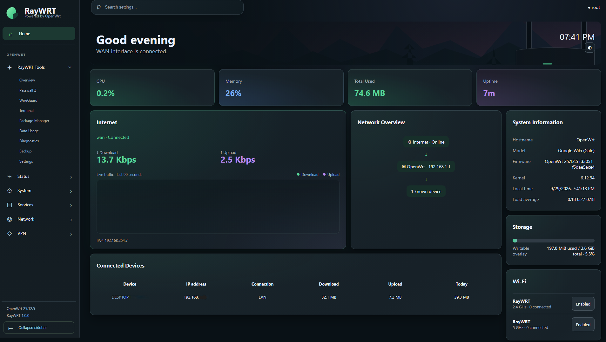
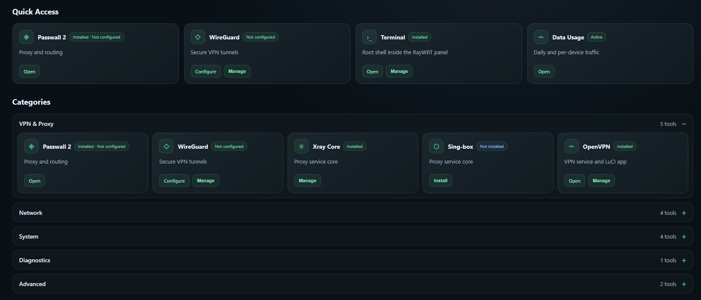
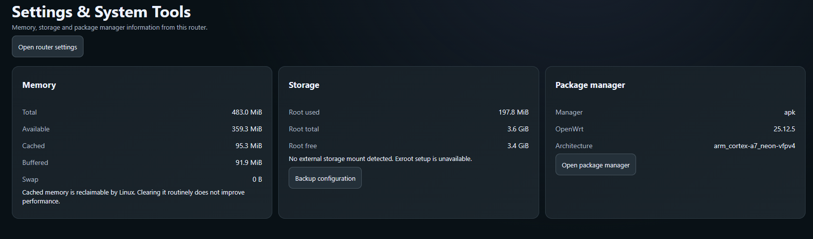
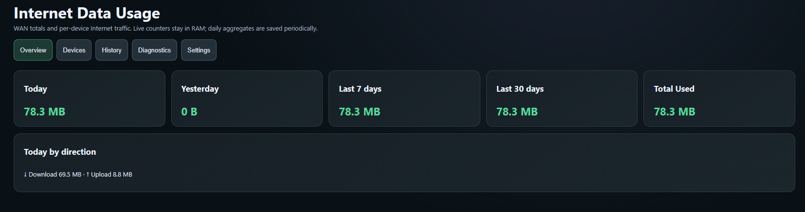
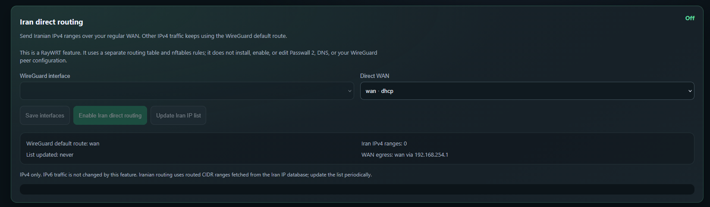
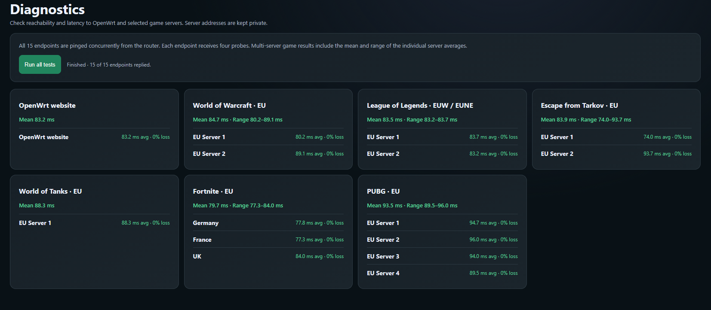
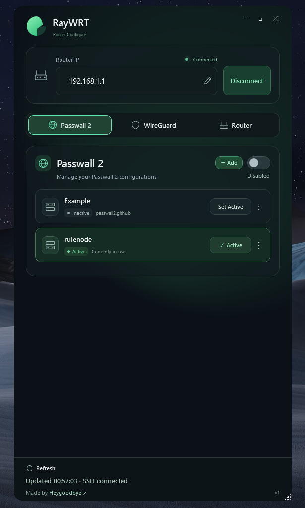
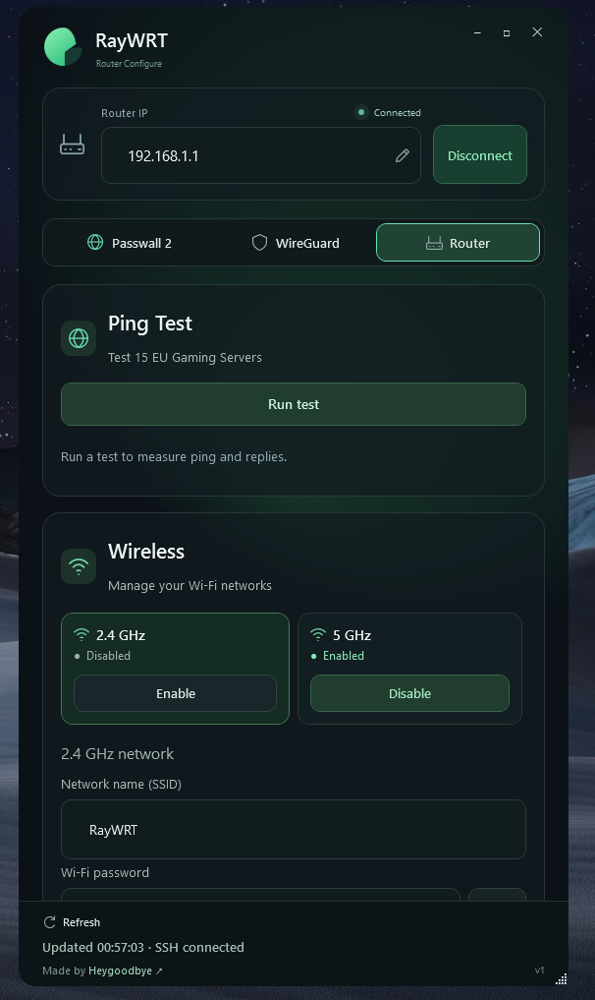

<p align="center">
  
</p>
<h1 align="center">RayWRT</h1>
<h3 align="center">OpenWrt Router Dashboard &amp; Companion Apps</h3>
<p align="center">A modern LuCI interface with live traffic stats, VPN controls and Iran Direct routing.<br>Manage your router from the web panel, Windows or Android.</p>
<p align="center">
  <a href="https://github.com/Heygoodbye/RayWRT/releases/tag/v1.1"></a>
  
  
  <a href="LICENSE"></a>
</p>
<p align="center"><a href="https://github.com/Heygoodbye/RayWRT/releases/tag/v1.1">📥 Download the latest release</a></p>
<p align="center"><a href="english.md">English</a> · <a href="FA.md">فارسی</a></p>

---

> **🧪 Tested only on Google WiFi AC-1304 (Gale) running OpenWrt 25.12.5. Other devices and firmware versions are unverified.**

RayWRT is a dark green LuCI theme, live dashboard, and router tools package, with Windows and Android companions. Created by [Heygoodbye](https://github.com/Heygoodbye), it uses real router data and keeps native OpenWrt administration accessible.

## 🆕 What’s new in v1.1

Fixed boot/upgrade usage totals and the Internet chart; reduced unused dashboard data requests while keeping fast refresh. Apps now verify RayWRT firmware, fix WPA2/WPA3 Wi-Fi saving, and improve connection stability. [Full English / Persian release notes](RELEASE_NOTES_v1.1.md).

## 🧪 Compatibility and status

| Component | Target |
| --- | --- |
| Router | Google WiFi AC-1304 (Gale) |
| OpenWrt | 25.12.5 / r33051-f5dae5ece4 |
| Target / profile | ipq40xx/chromium / google_wifi |
| Firmware package | RayWRT 1.1.0 |
| Windows companion | Windows x64, WPF / .NET |
| Android companion | Android 8.0 or newer |

✅ Build, metadata, payload inspection, and checksum checks passed.

📦 RayWRT v1.1 is published as a regular GitHub release. Build and image verification passed; formal clean-sysupgrade acceptance is still **pending**. App versions are independent of the firmware version.

## 📊 LuCI and dashboard

- Dark interface with green accents, rounded cards, shadows, and a decorative background toggle.
- Collapsible desktop sidebar, settings search, and native application submenus.
- Responsive mobile layout with Home, Tools, Passwall, Terminal, and More in a floating bottom dock.
- Live CPU, memory, uptime, Total Used, firmware/kernel, local time, load, and writable storage.
- WAN status/IP, live download/upload speeds, and recent traffic chart.
- Network overview and known devices with IP, connection information, download, upload, and daily usage.
- Wi-Fi radio/SSID status, native settings links, backup/upgrade, and reboot shortcuts.



Device identification uses DHCP, neighbour information, and Wi-Fi associations. Unknown devices remain unknown. Temperature appears only with a usable CPU/SoC sensor; Gale has no verified CPU reading. WAN Connected describes interface state, not proven Internet reachability.

## 🧰 RayWRT Tools

- Quick Access and grouped VPN, Network, System, Diagnostics, and Advanced tools.
- Separate installed, configured, and running states.
- Package manager/architecture detection, feed checks, free space, and install logs.
- Background installation/routing jobs with progress polling to avoid long LuCI XHR requests.
- Passwall 2, WireGuard, Xray, sing-box, OpenVPN, and ttyd integration where packages are available.
- Interfaces, routing, firewall, Wi-Fi, packages, backup, storage/memory, and logs shortcuts.
- Native OpenVPN manager routing and native WireGuard interface support.

Optional packages install on demand. Listing a tool does not mean it is bundled or running. Passwall on this APK target uses a signed feed and handles the ip-tiny/ip-full provider conflict in one transaction. Installed but stopped or unconfigured still counts as installed.





## 📈 Data Usage

WAN totals, download/upload, today, yesterday, last 7/30 days, per-device traffic, and daily history. Overview, Devices, History, Diagnostics, and Settings provide accounting controls, configurable retention/save interval, and confirmed history clearing. Live counters stay in RAM; daily aggregates are saved periodically.

These are recorded statistics rather than ISP billing figures. WAN and device totals can differ because router-originated traffic and device attribution use different accounting boundaries.



## 🇮🇷 WireGuard Iran Direct routing

Iranian **IPv4** ranges use the selected regular WAN; other IPv4 traffic follows the selected WireGuard default route. Choose the tunnel and WAN separately, update/validate the Iran list, and view range count, last update, and route state. A dedicated nftables table and policy routing keep this feature independent of Passwall 2. The list is validated before use and refreshes periodically while enabled. Upstream list updates are scheduled every six hours. Range counts can change as adjacent ranges are merged or the upstream data changes.

Enable activates the selected full-tunnel interface and prepares its default route if needed, restoring its activation changes when the route check fails. Disable, or deletion of the selected interface, cleans up RayWRT policy. IPv6 is unchanged. A valid peer allowing `0.0.0.0/0`, reachable endpoint, and suitable firewall are required. Route/interface state does not verify a recent handshake. No personal VPN keys, endpoints, or Meli configuration are bundled.



## 💻 Embedded terminal

The embedded root terminal uses ttyd and xterm.js inside LuCI, with Connect, Disconnect/Stop, status reporting, and responsive layout. Access uses the LuCI/RayWRT session and lifecycle helper. Stop the session when finished; it has router administrator privileges.

## 🎮 Gaming diagnostics

Tests run concurrently from the router to the OpenWrt website and EU servers for:

- World of Warcraft
- League of Legends EUW / EUNE
- Escape from Tarkov
- World of Tanks
- Fortnite in Germany, France, and the UK
- PUBG

Results show ping, packet loss, reply counts, and the average and range across each game's servers. Previous results stay visible while Testing appears beside a new run. Raw game IP addresses are hidden behind server names or numbers. These are ICMP tests; in-game latency may differ.



## 📱 Windows / Android app features

| Area | Features |
| --- | --- |
| 🔌 Router connection | SSH login, connection status, refresh, and SSH fingerprint confirmation. Passwords are not saved. |
| 🌐 Passwall 2 | Enable/disable, switch nodes, add a node link or subscription, manually update subscriptions, delete eligible configurations, and open LuCI. |
| 🛡️ WireGuard | View/connect/disconnect tunnels; import a `.conf` file or pasted configuration; assign the imported interface to the WAN firewall zone; synchronize the selected tunnel with RayWRT Iran Direct routing. |
| 🧰 Router tools | Test the 15 configured diagnostic endpoints, manage 2.4/5 GHz Wi-Fi, change SSID/password, and confirm reboot. |
| 🎨 Design | Dark responsive panels, connection heartbeat, author link; Windows has a draggable borderless window and portable/per-user install options. |

Both apps read real UCI/ubus state through SSH. The 15-endpoint set includes the OpenWrt website alongside EU game endpoints. SSH Connected describes the session; WireGuard Connected describes interface state, not Internet access or handshake. Apps need sufficient router permissions and manage router tunnels rather than creating a local phone/PC VPN.

The supplied application screenshots show Windows; Android provides the same main control areas.

<p> </p>

## 📥 Downloads

1. [Google WiFi Gale sysupgrade — OpenWrt 25.12.5](https://github.com/Heygoodbye/RayWRT/releases/download/v1.1/raywrt-1.1.0-gale-sysupgrade.bin)
2. [Windows x64 installer](https://github.com/Heygoodbye/RayWRT/releases/download/v1.1/RayWRT-v1.1-Windows-x64-Setup.exe)
3. [Android universal APK — Android 8+](https://github.com/Heygoodbye/RayWRT/releases/download/v1.1/RayWRT-v1.1-Android-universal.apk)

[Release notes and SHA256 checksums](https://github.com/Heygoodbye/RayWRT/releases/tag/v1.1)

## 🚀 Installation

### Recommended: install the GitHub Release sysupgrade — Gale only

Download `raywrt-1.1.0-gale-sysupgrade.bin` from [GitHub Releases](https://github.com/Heygoodbye/RayWRT/releases/tag/v1.1) and install it through LuCI. This is the recommended installation method.

This `.bin` is a sysupgrade image for a Gale already running OpenWrt. It is not an image for installing from Google's stock firmware. For a stock router, follow the [OpenWrt Google WiFi installation guide](https://openwrt.org/toh/google/wifi) first.

1. Connect your computer to the router by Ethernet. Open LuCI at your router's LAN address, usually `http://192.168.1.1`, and sign in.
2. Open **System → Backup / Flash Firmware**. Download a configuration backup and keep a matching recovery image available. Read the [Gale recovery guide](release/raywrt-1.1.0-gale/GALE_RECOVERY.md).
3. Download the Gale sysupgrade from GitHub Releases. The optional checksum check below lets you compare your download with the SHA256 in the release notes.

4. In LuCI's **Flash new firmware image** section, select the `.bin`, upload it, and review the compatibility check. Do not force a mismatched image. This image includes a swconfig-to-DSA compatibility notice; do not preserve incompatible settings.
5. For a clean first RayWRT installation, clear **Keep settings and retain the current configuration**. This erases saved router settings, including Wi-Fi passwords and VPN configurations. If upgrading an existing compatible RayWRT installation and keeping settings, fresh-install defaults will not replace your custom configuration.
6. Confirm the flash, keep power connected, and wait for the router to reboot. Reconnect to its LAN and open `http://192.168.1.1` for a clean installation. Both default AP SSIDs are `RayWRT`; configure your root password, Wi-Fi security, WAN, and VPN settings afterward.

<details>
<summary>🔐 Optional: check the download's SHA256 in Windows PowerShell</summary>

This checks the downloaded file; it does not install or flash firmware. Open PowerShell in the folder containing the sysupgrade and run:

```powershell
Get-FileHash .\raywrt-1.1.0-gale-sysupgrade.bin -Algorithm SHA256
```

Compare the result with the firmware SHA256 in the [GitHub Release notes](https://github.com/Heygoodbye/RayWRT/releases/tag/v1.1). If they differ, download the file again and do not flash it.

</details>

### Windows app

1. Download `RayWRT-v1.1-Windows-x64-Setup.exe` and run the installer on Windows x64.
2. Open RayWRT, enter your router's LAN address, SSH username (usually `root`), and password, then connect.
3. Compare the displayed SSH fingerprint with your router's known fingerprint before accepting it. Your computer must be able to reach the router and SSH must be enabled.

### Android app

1. Download `RayWRT-v1.1-Android-universal.apk` on a device running Android 8 or newer.
2. Allow **Install unknown apps** for the browser or file manager used to open the APK, then install it. You can disable that permission afterward.
3. Join the router's network, open RayWRT, enter its SSH address/username/password, and verify the fingerprint before connecting.

The apps control the router; installing an app does not flash firmware or create a VPN on your phone or computer.

## 🔧 Source and builds

| Path | Contents |
| --- | --- |
| `htdocs/`, `ucode/`, `root/`, `Makefile` | LuCI interface, templates, backend helpers, services, ACLs, and package metadata |
| `companion/` | Windows application source and installer |
| `android/` | Android source, build script, tests, and library license notices |
| `tests/` | Router-related fixture tests |
| `release/raywrt-1.1.0-gale/` | Pinned build inputs and frozen firmware package source |
| `docs/screenshots/` | Dashboard and application screenshots |

Follow [the Gale guide](BUILD_GALE_1.1.0.md) and [portable Linux build guide](release/raywrt-1.1.0-gale/BUILD.md) in Ubuntu/WSL2. Keep pinned OpenWrt/feed revisions and profile `google_wifi`. Expected image: `raywrt-1.1.0-gale-sysupgrade.bin`. Back up before upgrading and follow [Gale recovery preparation](release/raywrt-1.1.0-gale/GALE_RECOVERY.md); verify metadata and SHA256. Fresh stock APs use `RayWRT` on both bands; custom SSIDs are preserved on upgrade.

Build Windows with `companion/RayWRT.Companion.csproj` and its .NET SDK. See [Android instructions](android/README.md) and `android/build.ps1`; the script obtains tools and creates a local signing key. Signing keys, backups, and build caches are excluded from Git. Get the sysupgrade, Windows x64 installer, and Android universal APK from [GitHub Releases](https://github.com/Heygoodbye/RayWRT/releases/tag/v1.1). SHA256 checksums are provided in the release notes.

## 🙏 License and credits

RayWRT source uses [Apache-2.0](LICENSE). Third-party components retain their licenses; see the xterm.js license and Android notices.

- [OpenWrt](https://github.com/openwrt/openwrt) and [LuCI](https://github.com/openwrt/luci): firmware, UCI/ubus, native administration, and theme/package infrastructure.
- [farshidmousavii/iran-ip-ranges](https://github.com/farshidmousavii/iran-ip-ranges): Iran IPv4 list (MIT).
- [Openwrt-Passwall/openwrt-passwall2](https://github.com/Openwrt-Passwall/openwrt-passwall2): Passwall 2 manager.
- [Openwrt-Passwall/openwrt-passwall-build](https://github.com/Openwrt-Passwall/openwrt-passwall-build): Passwall APK feed/build infrastructure.
- [saeed9400/IRAN_Passwall2](https://github.com/saeed9400/IRAN_Passwall2): Iran-routing inspiration and installer reference for compatible opkg firmware; its opkg script is not run on this APK target.
- [WireGuard](https://www.wireguard.com/), [Xray-core](https://github.com/XTLS/Xray-core), [sing-box](https://github.com/SagerNet/sing-box), and [OpenVPN](https://github.com/OpenVPN/openvpn): optional VPN/proxy components.
- [ttyd](https://github.com/tsl0922/ttyd) and [xterm.js](https://github.com/xtermjs/xterm.js): terminal transport/rendering.
- [SSH.NET](https://github.com/sshnet/SSH.NET): Windows SSH; [mwiede/JSch](https://github.com/mwiede/jsch) and [Bouncy Castle](https://github.com/bcgit/bc-java): Android SSH/cryptography.
- [.NET](https://github.com/dotnet/runtime) and [NSIS](https://nsis.sourceforge.io/): Windows runtime/installer.

Thanks to these projects and their contributors 💚 RayWRT is independent and is not an official Google or upstream-project product.
